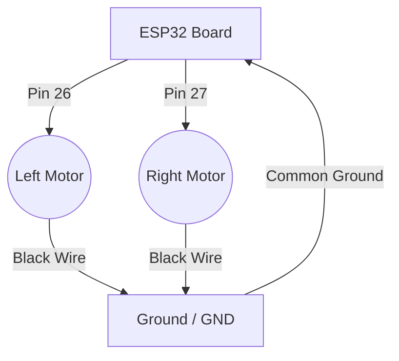

# Silent GPS Navigation System (Haptic Compass)

**Project by:** Sidharth K  
**Description:** A wearable navigation aid for visually impaired users. It uses haptic feedback (vibrations) to indicate direction (Left/Right) without blocking hearing.

## 📂 Project Structure
-   **`firmware/`**: The code for the ESP32 Microcontroller.
-   **`web_controller/`**: The Companion Web App to control the device from a phone/laptop.

---

## 🛠️ Phase 1: Hardware Setup

### Components Needed
1.  **ESP32 Development Board**
2.  **2x Haptic Vibration Motors** (Coin cell or similar)
3.  **Jumper Wires**
4.  **Breadboard** (optional, but good for testing)

### 🔌 Circuit Diagram (Wiring)

Connect the motors to the ESP32 pins as follows. 
*Note: If your motors are tiny (coin cell), you can connect them directly for a short test. For long-term use, use a Transistor (2N2222) to protect the ESP32.*

**Pin Mapping:**
| Component | ESP32 Pin |
| :--- | :--- |
| **Left Motor (+)** | GPIO **26** |
| **Right Motor (+)** | GPIO **27** |
| **Ground (-)** | **GND** |

---

## 💻 Phase 2: Flash the Firmware

1.  Download and Install the **Arduino IDE**.
2.  Open the file: `firmware/firmware.ino`.
3.  Connect your ESP32 to your PC via USB.
4.  In Arduino IDE:
    *   **Board**: Select "DOIT ESP32 DEVKIT V1".
    *   **Port**: Select the COM port that appears.
5.  Click the **Arrow Button (➡)** to Upload.
    *   *Tip: If it says "Connecting...", hold the BOOT button on the ESP32 until it starts writing.*

---

## 📱 Phase 3: Run the Controller

1.  Go to the `web_controller` folder.
2.  Double-click `index.html`. It should open in **Google Chrome** (or Edge).
3.  **Important**: If you are on a computer, you might need to enable Bluetooth on your PC. If on Android, just open the file in Chrome.
    *   *Troubleshooting*: If `file://` access blocks Bluetooth, you may need to use a simple local server (VS Code "Live Server" extension is best).

### How to Use
1.  Power on your ESP32 (LED should be on).
2.  On the Web App, click **"Connect Device"**.
3.  Select **"Silent Compass"** from the list of Bluetooth devices.
4.  Once connected, press **LEFT** or **RIGHT** on the screen.
5.  You should feel the corresponding motor vibrate!

## 🎓 Demo Explanation (What to say)
"This project solves the problem of distraction for visually impaired users. Instead of listening to a voice saying 'Turn Left' while trying to listen to traffic, the user feels a simple vibration on their left side. We used an ESP32 for the brain and a custom Web Bluetooth controller to demonstrate the wireless communication."
